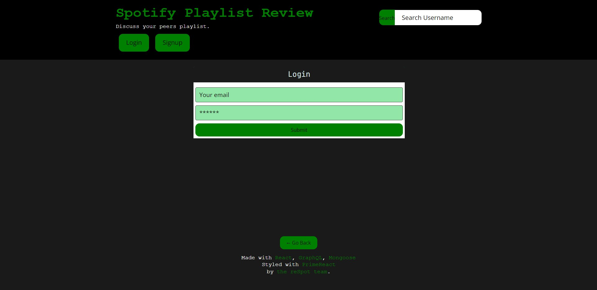
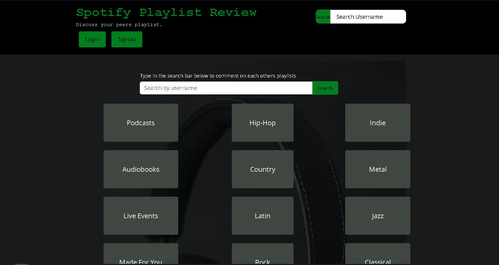
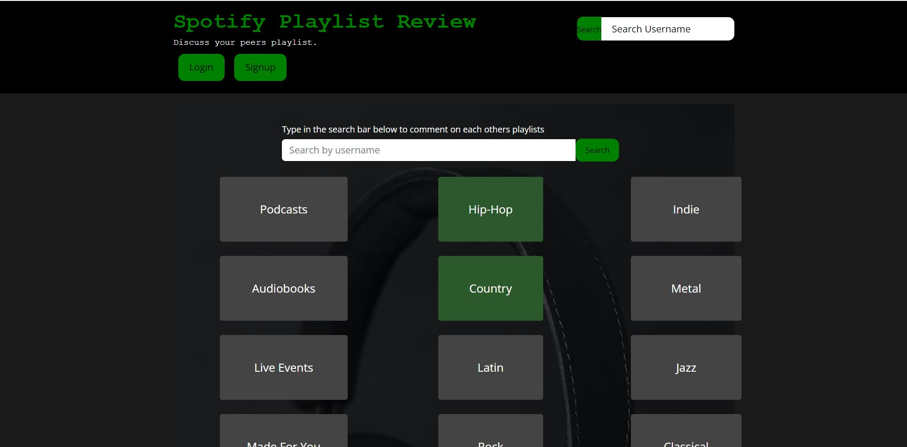
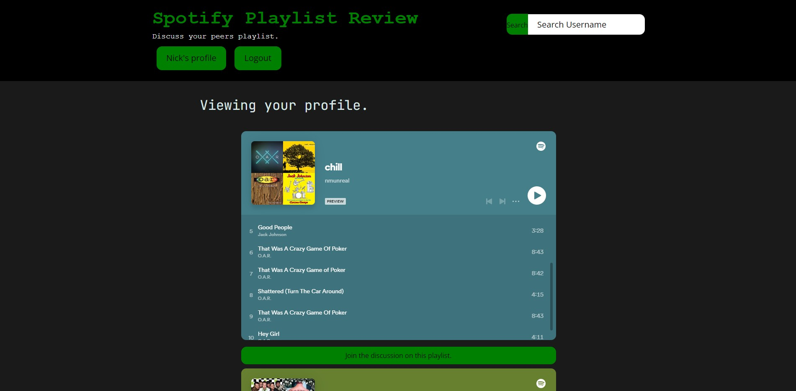
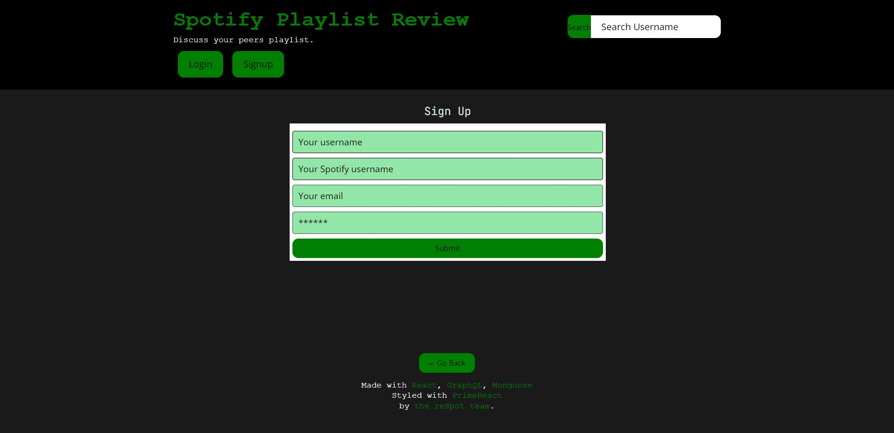
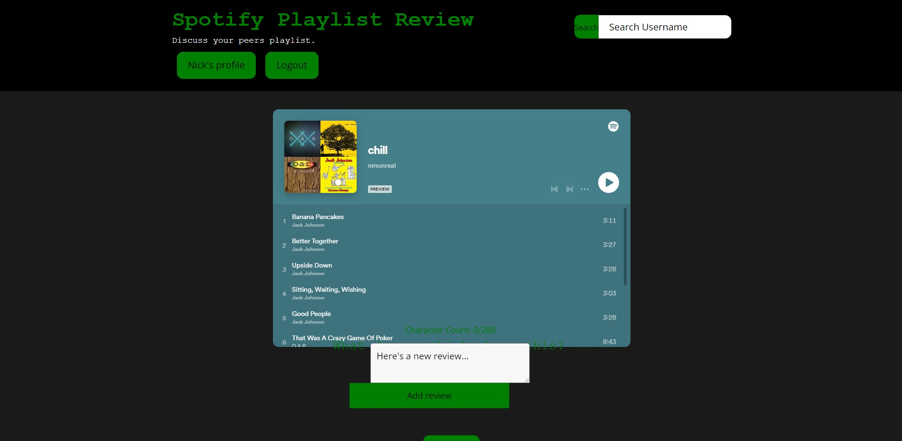

# Spotify-Review

## Table of contents
* [How it works](#how-it-works)
* [API's](#apis-used)
* [Database](#database)
* [WireFrame](#wireframe)
* [Preview](#preview)
* [Books](#Books-page)
* [Functions](#functions)
* [Future Features](#future-features)
* [Collaborators](#collaborators)

## How it Works

This website is a community-driven platform where people share and review their favorite Spotify playlists. Users can search for playlists based on specific users and leave ratings and comments to share their thoughts with the community. The website will also features a leaderboard of the most reviewed playlists and a section for featured curators. Overall, it's a great place to discover new music and connect with other music lovers.

## APIs Used

Spotify23
- https://rapidapi.com/Glavier/api/spotify23

## Database

MongonDB
    - MongoDB is a source-available cross-platform document-oriented database program. Classified as a NoSQL database program, MongoDB uses JSON-like documents with optional schemas.

Mongoose
    - Mongoose is a JavaScript object-oriented programming library that creates a connection between MongoDB and the Node.js JavaScript runtime environment

## WireFrame





- HTML - this is the markup language for our document to be displayed on the web browser
- CSS - this is the language we use to style an HTML document as well as describes how HTML elements should be displayed.
- JavaScript - this  is a scripting language that enables you to create dynamically updating content, control multimedia, animate images, and pretty much everything else
- React - this allows developers to build reusable UI components that can be easily composed to create complex user interfaces. It follows a declarative approach where developers describe how the UI should look and behave in response to changes in state, rather than imperatively defining how to manipulate the DOM.
- MongoDB - this is an open-source, NoSQL, document-oriented database management system. It is designed to store and manage data in a flexible and scalable manner.

## Preview


## Functions






## Latest Development Changes
```
Deployed: 
```

## Future Features
With this project we would like to expand our scope beyond

These are some of our purposed additions:
- We would like to let the user connect and follow said playlists through the site
- We would like to let the user sample 30 second snippetsof songs from the playlists
- We would like to allow users to search genres instead of just users playlists for broader searching


# Resources
- [W3schools](https://www.w3schools.com)
- [Developer.Mozilla](https://developer.mozilla.org/en-US)
- [Geeksforgeeks](https://www.geeksforgeeks.org/javascript)
- [Heroku](https://heroku.com/login)
- [PrimeReact](https://primereact.org)

## License
 [](https://opensource.org/licenses/MIT) 

# Primary Collaborators
- Reuben Schmolke [Github](https://github.com/RoobyDoobster)
- Zechariah Barrett [Github](https://github.com/ZechB7)
- Jacob Maynard [Github](https://github.com/Maynardj123)
- Nick McCarthy [Github](https://github.com/Nick-McCarthy)
- Holden Claus [Github](https://github.com/HoldyClaus)

## Secondary Collaborators
- Ian 
- Diem Ly
- Leah Nelson
- Sean Roshan